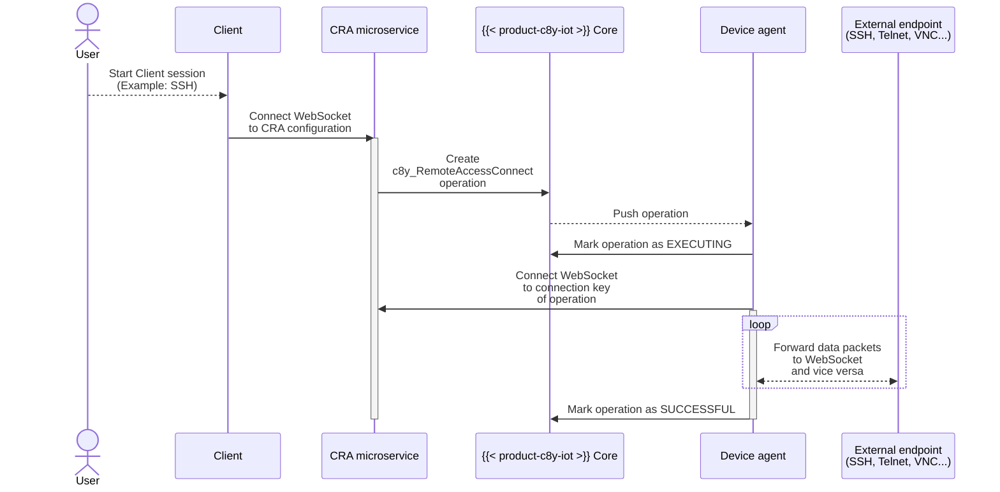

The diagram above illustrates the end-to-end integration between a user's client and the corresponding external server via Cloud Remote Access (CRA).
In such a setup, we distinguish between the following participants and components:

- A ** user**, who wants to access an external service like a web server or SSH that is only reachable from a remote device.
- The **client**. This often is a shell in the  UI; alternatively it can be a forwarding proxy like [C8Y Cli](https://goc8ycli.netlify.app/docs/examples/remoteaccess/) or even a custom client application seeking access to the external service.
- The **Cloud Remote Access (CRA)** microservice at `/service/remoteaccess`.
- The ** Core platform** (see also the [ ](https://cumulocity.com/api/)).
- The **device agent**. A common open-source agent is [thin-edge.io](https://thin-edge.io/).
- An arbitrary **external endpoint**, typically a SSH, HTTP, Telnet or VNC server.

In the following, we now describe both how to implement a device-side agent and a client application that connects to the device-side agent via CRA.
